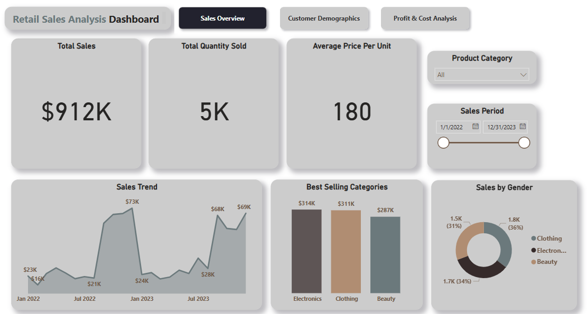

# Retail_Sales_Analysis

# 🛍️ Retail Sales Analysis – SQL + Power BI Project

## 📌 Project Overview
This end-to-end project analyzes retail sales data using SQL and Power BI. It showcases how raw transactional data can be transformed, analyzed, and visualized to uncover insights around customer behavior, category performance, and sales trends.
  
- **Tools**: PostgreSQL (SQL), Power BI  
- **Dataset**: Retail sales data  

---

## 🎯 Objectives

- Set up and query a structured retail database  
- Clean and prepare the data using SQL  
- Explore sales, customer, and product trends  
- Build an interactive dashboard in Power BI for business stakeholders  

---

## 🗂️ Dataset Description

| Column             | Description                                  |
|--------------------|----------------------------------------------|
| `transactions_id`  | Unique transaction identifier                |
| `sale_date`        | Date of the transaction                      |
| `sale_time`        | Time of transaction                          |
| `customer_id`      | Unique customer identifier                   |
| `gender`           | Gender of customer                           |
| `age`              | Age of the customer                          |
| `category`         | Product category                             |
| `quantity`         | Quantity of items purchased                  |
| `price_per_unit`   | Unit price of the item                       |
| `cogs`             | Cost of goods sold                           |
| `total_sale`       | Total transaction value                      |

Derived columns:
- **Profit** = `total_sale - cogs`  
- **Profit Margin** = `(Profit / total_sale) * 100`

---

## 📈 Power BI Dashboard

### 🔹 Page 1: Sales Overview  
**Goal:** Show KPIs and category-level performance.  

**Visuals:**  
- **KPI Cards**: Total Sales, Total Quantity, Average Price per Unit 
- **Line Chart**: Sales over Time  
- **Bar Chart**: Best Selling Categories
- **Donut Chart**: Sales by Gender



---

### 🔹 Page 2: Customer Demographics  
**Goal:** Understand who the customers are.  

**Visuals:**  
- **KPI Cards**: Total Customers, Average Customer Age
- **Donut Chart**: Gender Distribution  
- **Bar Chart**: Age Group Distribution and Gender vs Total Sales 
- **Scatter Plot**: Age vs. Average Purchase Value 


---

### 🔹 Page 3: Profit & Cost Analysis  
**Goal:** Understand profitability and cost dynamics.  

**Visuals:**  
- **KPI Cards**: Total Cost of Goods Sold, Total Profit, Profit Margin
- **Bar/Column Chart**: Profit by Category
- **Bar/Column Chart**: Highest Cost Categories 
- **Scatter Plot**: Profitability Trends by Price 


---


### 🔍 Key Insights  
- **Customer Behavior**: Ages 46–55 are most active  
- **Sales Trends**: Seasonal patterns with clear peaks  
- **Top Products**: Clothing & Beauty dominate  

---

## SQL Queries for Retail Sales Analysis

In this section, I provide a set of SQL queries used to analyze sales data, retrieve insights, and perform specific tasks based on the retail sales data.

### 1. Sales on a Specific Date
**Query:** Retrieve all columns for sales made on '2022-11-05'

```sql
SELECT *
FROM retail_sales
WHERE sale_date = '2022-11-05'
```

### 2. Clothing Sales in November 2022 with Quantity Sold More Than 4
**Query:** Retrieve all transactions where the category is 'Clothing' and the quantity sold is more than 4 in the month of November 2022

```sql
SELECT 
  *
FROM retail_sales
WHERE 
    category = 'Clothing'
    AND 
    TO_CHAR(sale_date, 'YYYY-MM') = '2022-11'
    AND
    quantity >= 4;

```


### 3. Total Sales for Each Category
**Query:** Calculate the total sales (total_sale) for each category

```sql
SELECT 
    category,
    SUM(total_sale) as net_sale,
    COUNT(*) as total_orders
FROM retail_sales
GROUP BY 1;


```

### 4. Average Age of Customers Who Purchased from 'Beauty' Category
**Query:** Find the average age of customers who purchased items from the 'Beauty' category

```sql
SELECT
    ROUND(AVG(age), 2) as avg_age
FROM retail_sales
WHERE category = 'Beauty';

```

### 5. Number of Transactions by Gender and Category
**Query:** Find the total number of transactions made by each gender in each category

```sql
SELECT 
    category,
    gender,
    COUNT(*) as total_trans
FROM retail_sales
GROUP 
    BY 
    category,
    gender
ORDER BY 1;


```

### 6. Best Selling Month of Each Year
**Query:** Calculate the average sale for each month and find the best-selling month for each year

```sql
SELECT 
       year,
       month,
    avg_sale
FROM 
(    
SELECT 
    EXTRACT(YEAR FROM sale_date) as year,
    EXTRACT(MONTH FROM sale_date) as month,
    AVG(total_sale) as avg_sale,
    RANK() OVER(PARTITION BY EXTRACT(YEAR FROM sale_date) ORDER BY AVG(total_sale) DESC) as rank
FROM retail_sales
GROUP BY 1, 2
) as t1
WHERE rank = 1;


```

### 7. Number of Orders by Shift (Morning, Afternoon, Evening)
**Query:** Create each shift (Morning <12, Afternoon 12-17, Evening >17) and count the number of orders

```sql
WITH hourly_sale
AS
(
SELECT *,
    CASE
        WHEN EXTRACT(HOUR FROM sale_time) < 12 THEN 'Morning'
        WHEN EXTRACT(HOUR FROM sale_time) BETWEEN 12 AND 17 THEN 'Afternoon'
        ELSE 'Evening'
    END as shift
FROM retail_sales
)
SELECT 
    shift,
    COUNT(*) as total_orders    
FROM hourly_sale
GROUP BY shift;

```

## Resources:
- The **Power_BI** section contains all the pages with screenshots and the Power BI file.
- The **SQL** section includes all the SQL queries with explanations in the same document.
- The **Data** section provides the dataset used for this project.

Now everything is in one file. Let me know if you need any further adjustments!

